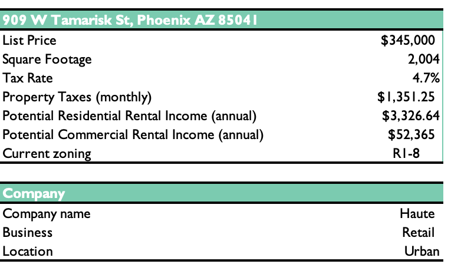
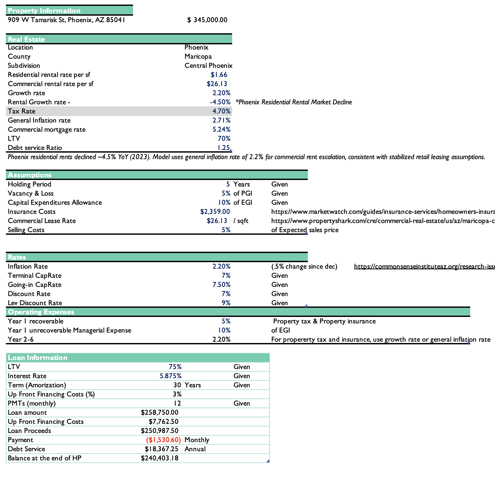
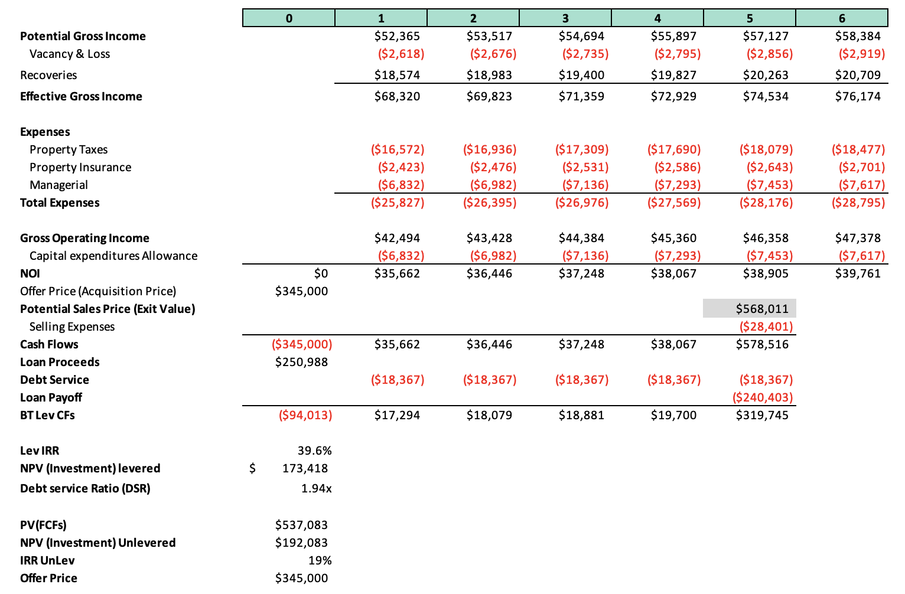

# Commercial Real Estate DCF Valuation Model
### Residential-to-Commercial Conversion & Repositioning Analysis

## Overview

This model underwrites the acquisition and conversion of a residentially-zoned property for commercial usethrough DCF valuation. It projects stabilized 6-year operating cash flows, models debt financing, and calculates both unlevered and levered equity returns.

> [!NOTE]
> This model assumes the property is acquisition-ready for commercial conversion. Upfront zoning and buildout costs are not modeled separately.## Key Features

- Commercial cash flow projections (5-year holding period)
- Leveraged & unlevered DCF analysis
- Operating income & expense modeling with inflation
- Debt service calculations (30-year amortization, LTV-based financing)
- Exit value analysis via cap rate method
- Equity return metrics (Levered IRR, NPV, DSCR)
- Sensitivity analysis on cap rates and growth assumptions


## Model Components

### Property Profile

- **Address:** `909 W Tamarisk St, Phoenix, AZ 85041`
- **Current Zoning:** `R1-8 (Residential)`
- **Square Footage:** `2,004 SF`
- **Acquisition Price:** `$345,000`
- **Projected Use:** `Commercial Retail (urban location)`
- **Company:** `Haute (Retail business)`




### Real Estate Market Assumptions (Phoenix Central Phoenix)**

- **Residential Rental Rate:** `$1.66/SF` _(declining -4.5% annually)_
- **Commercial Rental Rate:** `$26.13/SF` _(growing 2.2% annually)_
- **Property Tax Rate:** `4.7%`
- **General Inflation Rate:** `2.2%`
- **Mortgage Rate:** `5.875%` _(30-year amortization)_

## Key Assumptions

- **5-year hold:** Stabilization through Year 5, exit via cap rate sale
- **LTV 75%:** Moderate leverage typical for stabilized retail; reduces downside but impacts returns
- **5% vacancy:** Retail vacancy allowance for Central Phoenix market
- **10% CapEx reserve:** Annual building maintenance & capital replacement
- **Growth:** 2.2% annual escalation on commercial rents; residential declining -4.5%
- **Inflation:** 2.2% applied to taxes, insurance, labor costs
- **DSCR requirement:** 1.25x minimum (underwriting standard)
- **Exit strategy:** Cap rate sale at 7.0% (conservative vs. going-in 7.5%)


### Revenue Projections (Post-Conversion)

* Potential Gross Income (PGI)

```python
Year 1 PGI = Commercial Rent Rate ($26.13/SF) × Property SF (2,004)
PGI_Growth = PGI × (1 + 2.2% annual growth)
```

* Effective Gross Income (EGI)

```python
EGI = PGI - Vacancy Loss (5% of PGI) + Recoveries
Recoveries = Property Tax + Insurance (tenant-recoverable)
```

### Operating Expense Projections

* Property Taxes (escalating annually)

```python
Year 1 Property Tax = Property Value × 4.7% Tax Rate × (1 + 2.2% inflation)
Years 2-5 = Prior Year Tax × (1 + Growth Rate)
```

* Property Insurance

```python
Annual Insurance = $2,359 (fixed, escalates at 2.2% inflation)
```

* Management Expense

```python
Managerial = 10% of EGI (Year 1-5)
```

* Capital Expenditure Reserve

```python
CapEx Allowance = 10% of EGI (annual building maintenance reserve)
```

### Net Operating Income & Debt Service

* Gross Operating Income

```python
GOI = EGI + Total Expenses
```

* Net Operating Income (NOI)

```python
NOI = GOI - CapEx Allowance
```

* Debt Service Calculations

```python
Loan Amount = LTV × Acquisition Price = 75% × $345,000
Interest Rate: 5.875% (30-year amortization)
Monthly Payment = PMT(5.875%/12, 360 months, Loan Amount)
Annual Debt Service = Monthly Payment × 12
Upfront Financing Costs = 3% of Loan Amount
Loan Proceeds = Loan Amount - Financing Costs
```
> [!TIP]
> Adjust inputs in the Data tab to stress-test different financing scenarios (LTV, rate, term).

* Debt Service Coverage Ratio (DSCR)

```python
DSCR = NOI / Annual Debt Service
Underwriting guideline: Minimum 1.25x
```

### Exit & Terminal Value

* Year 5 Exit Value (Cap Rate Method)

```python
Terminal Cap Rate: 7.0% (given)
Going-in Cap Rate: 7.5% (given)
Exit Value (Year 5) = Year 6 NOI / Terminal Cap Rate
Implied NOI Yr6 = Year 5 NOI × (1 + growth)
```

* Sale Proceeds & Loan Payoff

```python
Sales Price = Exit Value (cap rate-based)
Selling Costs = 5% of Sales Price
Loan Balance at End of Hold = PV of remaining payments
Net Proceeds = Sales Price - Selling Costs - Loan Payoff
```

### Return Metrics

* Unlevered DCF

```python
Unlevered IRR = IRR of annual NOI (Years 1-5) + Exit Value
Unlevered NPV = NPV of cash flows at 7.0% discount rate
```

* Levered DCF

```python
Levered IRR = IRR of after-debt-service cash flows (Years 1-5) + Net Exit Proceeds
Levered NPV = NPV of levered cash flows at 9.0% discount rate
```

* Offer Price Analysis

```python
Offer Price = MIN(95% of Unlevered PV, Acquisition Price)
```



## File Structure

#### Commercial_Real_Estate_DCF_Model.xlsx

1. **Property** — Property address, zoning, rental rates, annual income calculations
2. **Data** — Market assumptions, financing terms, cap rates, holding period, expense assumptions
3. **CF Projections** — 5-year operating income, expenses, NOI, debt service, and exit analysis

| Metric | Value |
|---|---|
| Acquisition Price | $345,000 |
| LTV / Leverage | 75% / 0.75 |
| Loan Amount | $258,750 |
| Financing Costs (3%) | $7,763 |
| Loan Proceeds | $251,000 |
| Interest Rate | 5.875% |
| Amortization Period | 30 years |
| Holding Period | 5 years |
| Commercial Rent Rate | $26.13/SF |
| Property Size | 2,004 SF |
| Year 1 PGI | ~$52,433 |
| Going-in Cap Rate | 7.5% |
| Terminal Cap Rate | 7.0% |
| Discount Rate (Unlevered) | 7.0% |
| Discount Rate (Levered) | 9.0% |

## Valuation Summary

The model calculates returns across **two scenarios:**

1. **Unlevered** — Assumes 100% equity financing (no debt); represents property-level returns
2. **Levered** — Assumes 75% LTV debt; represents equity investor returns after debt service & payoff

Levered returns are higher if DSCR > 1.0x (leverage is accretive). If DSCR < 1.0x, property generates negative cash flow and leverage destroys returns.

## Tools

- Microsoft Excel: dynamic formulas, named ranges, PMT/PV functions, IRR/NPV calculations

## Sources

1. **Apartment List** — Phoenix, AZ Rental Market Data (2023-2024)
   - https://www.renthop.com/average-rent-in/phoenix-az

2. **KTAR News** — Maricopa County Tax Rate Cut (January 2023)

3. **Forbes Advisor** — Commercial Mortgage Rates (2023)

4. **Bureau of Labor Statistics** — U.S. Inflation Rate (December 2023): 2.71%

5. **City of Phoenix Planning & Development** — R1-8 Zoning District Regulations
   - https://www.phoenix.gov/pddsite/Documents/PZ/pdd_pz_pdf_00284.pdf

6. **Phoenix Municipal Code** — Zoning Ordinance §612
   - https://phoenix.municipal.codes/ZO/612

7. **National Association of Realtors** — Impact of Retail on Surrounding Property Values

8. **Journal of the American Heart Association** — Walkability & Cardiovascular Disease Risk
   - https://www.ahajournals.org/doi/10.1161/JAHA.119.013146

9. **PropertyShark** — Phoenix Commercial Lease Rates (Maricopa County)
   - https://www.propertyshark.com/cre/commercial-real-estate/us/az/maricopa-county/

10. **MarketWatch** — Arizona Homeowners Insurance Costs
    - https://www.marketwatch.com/guides/insurance-services/homeowners-insurance-arizona/

11. **Common Sense Institute Arizona** — Arizona Inflation Reports
    - https://commonsenseinstituteaz.org/research-issues/inflation-reports/

12. **UtilitiesOne** — Impact of Retail & Commercial Development on Residential Neighborhoods
    - https://utilitiesone.com/the-impact-of-retail-and-commercial-developments-on-residential-neighborhoods
      
## Disclaimer

> [!CAUTION]
*Built independently; Property data sourced from publicly available market data. All projections are estimates based on stated assumptions. Not investment advice.*

## License

© 2025 Kristen Gallagher. All rights reserved.

This work is made available for viewing and reference purposes only. Reproduction, distribution, modification, or use of this work without explicit written permission from the author is strictly prohibited. Any reference to this work must include appropriate credit to the author.
